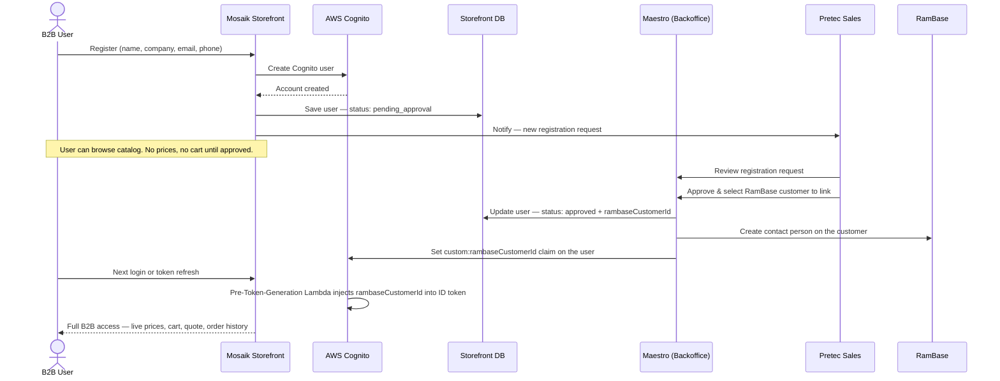
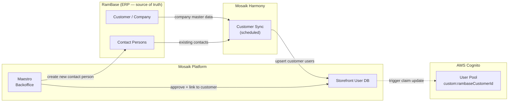

# Customer Sync Flows

---

## Diagram 1 — B2B Signup in Mosaik → Approval → Sync to RamBase

A new B2B user self-registers on the Mosaik Storefront. Pretec reviews and approves the registration in Maestro. On approval the user is linked to a RamBase customer and a contact person is created in RamBase.

---

## Diagram 2 — Two-way Sync: Customers & Contact Persons between RamBase and Mosaik

Two independent directions of sync:

- **RamBase → Mosaik** via Harmony: company master data and existing contact persons are synced on schedule. This is the source-of-truth flow — RamBase owns the customer record.
- **Mosaik → RamBase** on approval: when a new storefront user is approved in Maestro, they are written back to RamBase as a new contact person on the linked customer.

### Sync direction summary

| Direction | Trigger | Mechanism | What moves |
|---|---|---|---|
| RamBase → Mosaik | Scheduled (Harmony) | Mosaik Harmony Customer Sync | Company master data, existing contact persons |
| Mosaik → RamBase | User approved in Maestro | Direct API call (Maestro → RamBase) | New contact person created on the linked customer |

The dotted line from Storefront DB to Cognito indicates that `custom:rambaseCustomerId` is resolved at **token issuance** (Pre-Token-Generation Lambda), not written directly into Cognito by the sync — the claim is injected from the stored `rambaseCustomerId` on each login and refresh.
