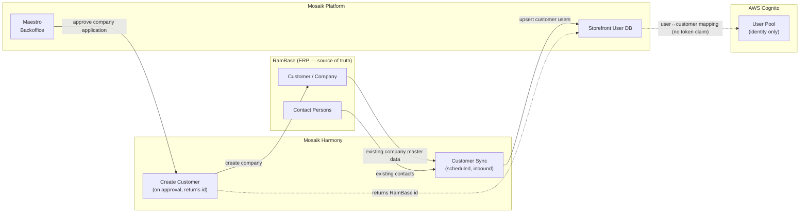

# Customer Sync Flows

> **Authoritative signup diagram:** [`sign-up.png`](sign-up.png). The Mermaid below mirrors it.

---

## Diagram 1 — B2B Signup → Company Application → Approval → User Invitation

A new B2B user self-registers on the Mosaik Storefront. This raises a **company application**. Pretec Sales
reviews it, fills in any extra information, and approves it in Maestro — which **creates the company in
RamBase** (via Harmony) and gets back the RamBase unique id. Pretec Sales then **invites** the user; the
**user account is created only when the invitation is accepted** (invitation-based onboarding).

```mermaid
sequenceDiagram
    actor User as New B2B User
    participant SF as Mosaik Storefront
    participant BE as Mosaik Backend
    participant Maestro as Maestro (Backoffice)
    participant Sales as Pretec Sales
    participant RB as RamBase

    User->>SF: Register (name, company, email)
    SF->>BE: Add company application (company / user)
    BE->>Sales: Notify by email — new registration

    Note over User,SF: No user account yet — created on invitation accept (below).

    Sales->>Maestro: Approve & fill in extra needed information
    Maestro->>BE: Approve pending customer — company is created
    BE->>RB: Create customer (by Harmony) — returns RamBase unique id

    Sales->>BE: Invite user
    BE->>SF: Send invitation for user
    SF-->>User: Invitation email

    User->>SF: Accept invitation
    SF->>BE: Create user — application set to completed
    Note over BE: Cognito user created; user↔RamBase-customer mapping recorded in Mosaik
    SF-->>User: Full B2B access — live prices, cart, quote, order history
```

**Notes**
- The **company is created in RamBase** as part of approval (genuinely new company onboarded from the
  storefront), and RamBase returns the unique id used to link the account.
- The **user account (Cognito user) is created at invitation acceptance**, not at registration — there is
  no "browse while pending as a logged-in user" window in this model.
- The **user↔RamBase-customer mapping is recorded in Mosaik** at account creation. Live
  price/cart/quote/orders resolve the RamBase customer from that mapping server-side — **no token claim**.

---

## Diagram 2 — Two-way Sync: Customers & Contact Persons between RamBase and Mosaik

Two independent directions of sync:

- **RamBase → Mosaik** via Harmony: **existing** company master data and contact persons are synced on
  schedule. RamBase is source of truth for companies that already exist there.
- **Mosaik → RamBase** on approval: when a **new company application** is approved in Maestro, the company
  is **created in RamBase via Harmony**, which returns the RamBase unique id linked back to the account.



### Sync direction summary

| Direction | Trigger | Mechanism | What moves |
|---|---|---|---|
| RamBase → Mosaik | Scheduled (Harmony) | Mosaik Harmony Customer Sync | **Existing** company master data and contact persons |
| Mosaik → RamBase | Company application approved in Maestro | Create Customer (via Harmony) | **New company created** in RamBase; returns the RamBase unique id |

The dotted lines indicate that the **RamBase id is returned to the Storefront DB on company creation**, and
the **user↔RamBase-customer mapping is held in Mosaik**. The Service API resolves the RamBase customer from
that mapping server-side per request — there is **no `rambaseCustomerId` token claim** and **no
Pre-Token-Generation Lambda**.
